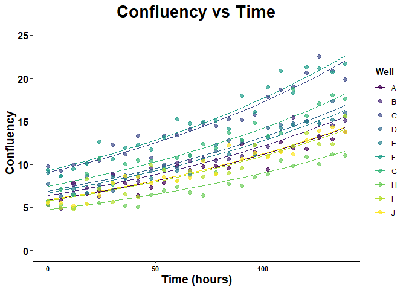
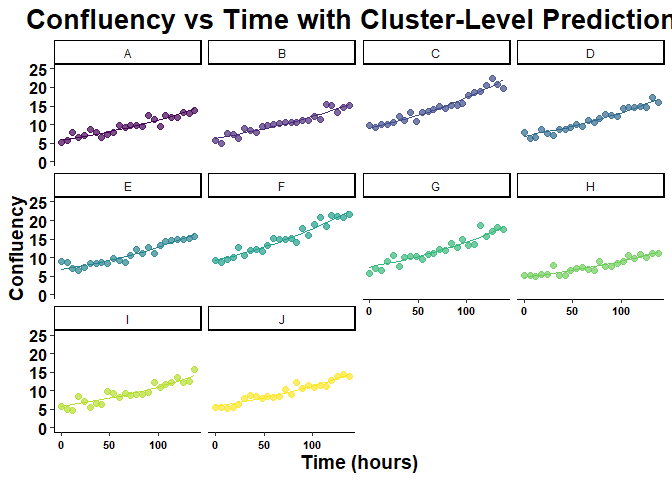
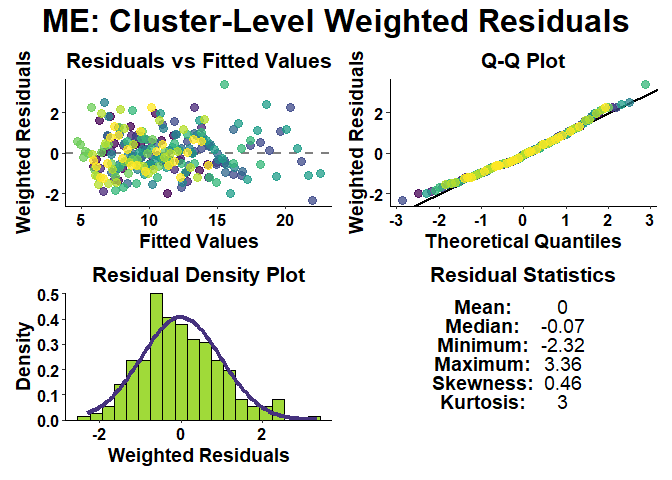
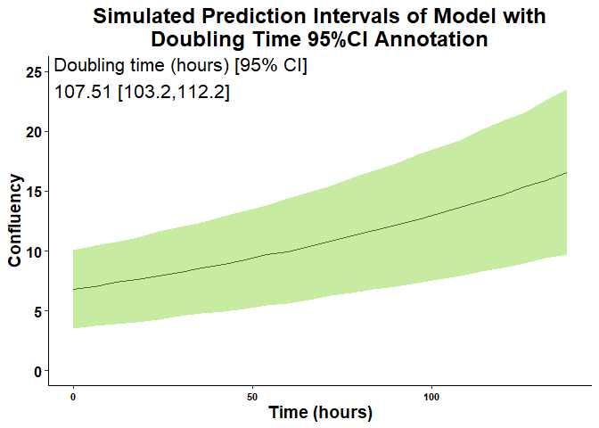

<!-- README.md is generated from README.Rmd. Please edit that file -->

# GrowthCurveME

<!-- badges: start -->
<!-- badges: end -->

In-vitro growth assays often exhibit high levels of technical and
experimental variability such as differences in seeding density,
well-to-well variation, and experimental replicate variation, which can
impact the accuracy of growth estimation and modeling. The goal of
GrowthCurveME is to address these aspects of variability by allowing
users to easily fit linear and non-linear mixed-effects regression
models to account for clustering (such as at the well-to-well level or
experimental level) and longitudinal repeated measurements.
GrowthCurveME utilizes convenient wrapper functions for the saemix
package to fit mixed-effects models, derive key growth metrics and model
statistics, perform model diagnostics, and generate plots and tables for
reporting your data.

## Installation

You can install the development version of GrowthCurveME from
[GitHub](https://github.com/) with:

``` r
install.packages("devtools")
devtools::install_github("cancermodels-org/GrowthCurveME")
```

You can also get the official release version from CRAN

``` r
install.packages("GrowthCurveME")
```

## Getting Started

First load the package and import a sample dataset. Here in this example
we have confluency-based growth assay data. In this experiment, there
are multiple “clusters” or well replicates. Although they all follow a
general growth pattern, each of the well replicates start at different
growth measurements.

``` r
# Load the GrowthCurveME package
library(GrowthCurveME)

# Load the ggplot2 and viridis package for graphing
library(ggplot2)
library(viridis)
#> Loading required package: viridisLite

# Load the exp_mixed_data dataset from GrowthCurveME package
data("exp_mixed_data")

# Inspect the data
str(exp_mixed_data)
#> 'data.frame':    240 obs. of  3 variables:
#>  $ cluster      : chr  "A" "A" "A" "A" ...
#>  $ time         : num  0 6 12 18 24 30 36 42 48 54 ...
#>  $ growth_metric: num  5.25 5.81 7.85 6.62 6.94 ...

# Create simple scatterplot of exp_mixed_data
ggplot(exp_mixed_data,
       aes(x = time, y = growth_metric, color = cluster)) +
  geom_point(size = 2) +
  scale_color_viridis(discrete = TRUE) +
  ylim(0, 25) +
  ggtitle("Example Growth vs Time Data") +
  theme_classic()
```


GrowthCurveME allows users to account for the well-to-well variation by
fitting a mixed-effects model with the growth_curve_model_fit()
function. In this case, the data appears to follow an exponential curve,
so one can set the function_type to “exponential”. GrowthCurveME is also
able to fit “linear”, “logistic”, and “gompertz” shaped functions to
data. By default, the growth_curve_model_fit() function will return a
list object that can be used with other functions in the GrowthCurveME
package. We can also fit a least-squares model for comparison, which
does not account for clustering.

``` r
# Fit an mixed-effect model and return a summary list output
exp_mix_model_summary <- growth_curve_model_fit(
  data_frame = exp_mixed_data,
  function_type = "exponential",
  model_type = "mixed",
  time_unit = "hours")
#> Number of clusters: 10 
#> Number of unique time points: 24 
#> Number of observations: 240 
#> The number of subjects is small, increasing the number of chains to 5 to improve convergence
#> Simulating data using nsim = 1000 simulated datasets
#> Computing WRES and npde .

# Fit a least-squares model for comparison
exp_ls_model_summary <- growth_curve_model_fit(
  data_frame = exp_mixed_data,
  function_type = "exponential",
  model_type = "least-squares",
  time_unit = "hours")
#> Number of unique time points: 24 
#> Number of observations: 240
```

Users can produce a summary table of the model results and derived
growth metrics for reporting. We can see in this example that the
confidence interval for the rate and doubling time estimates are
narrower than the least-squares regression model after accounting for
the inherit well-to-well variation. Model complexity metrics such as
Akaike information criterion (AIC), Bayesian information criterion
(BIC), and Log likelihood show that the mixed-effects model is better
suited for the data which contains clear hierarchical structures and
longitudinal measurements.

``` r
# Summarize mixed-effects model
growth_model_summary_table(
  growth_model_summary_list = exp_mix_model_summary
)
```


``` r
# Summarize least-squares model
growth_model_summary_table(
  growth_model_summary_list = exp_ls_model_summary
)
```


Users can inspect the results of the model by producing different types
of scatter plots with ggplot2 customization.

``` r
# Plot growth vs time data with cluster level predictions 
growth_vs_time_plot(
  growth_model_summary_list = exp_mix_model_summary,
  plot_type = 2,
  growth_metric_name = "Confluency",
  time_name = "Time (hours)",
  cluster_name = "Well",
  plot_title = "Confluency vs Time",
  y_limits = c(0, 25)
)
```



``` r

# Plot growth vs time data with cluster level predictions faceted by cluster
growth_vs_time_plot(
  growth_model_summary_list = exp_mix_model_summary,
  plot_type = 3,
  growth_metric_name = "Confluency",
  time_name = "Time (hours)",
  cluster_name = "Well",
  plot_title = "Confluency vs Time with Cluster-Level Predictions",
  y_limits = c(0, 25)
)
```



Users can also perform model diagnostics for mixed-effect (ME) and
least-squares (LS) models.

``` r
# Check residual diagnostics of model
growth_model_residual_plots(
  growth_model_summary_list = exp_mix_model_summary,
  residual_type = "cluster",
  weighted = TRUE
)
```



Users can also generate prediction interval plots to assist in viewing
the variability of the model estimates as well as add an annotation such
as the doubling time to the top corner of the plot.

``` r
# Graph prediction interval plots, add annotation from model, change aesthetics
growth_vs_time_plot(
  growth_model_summary_list = exp_mix_model_summary,
  plot_type = 4,
  growth_metric_name = "Confluency",
  time_name = "Time (hours)",
  cluster_name = "Well",
  plot_title = "Simulated Prediction Intervals of Model with\nDoubling Time 95%CI Annotation",
  y_limits = c(0, 25),
  plot_title_size = 18,
  annotate_value_text_size = 5.5
)
```



# Contact Information

If you have any questions please feel free to contact us at
<models@dfci.harvard.edu>.

# Creators and Contributors

- Anand Panigrahy (Senior Research Technician, Package Author and
  Developer) - <anand_panigrahy@dfci.harvard.edu>

- Sonam Bhatia (Associate Director of CPDM, Contributor) -
  <sonam_bhatia@dfci.harvard.edu>

- Thomas Quinn (Senior Research Technician, Data Contributor) -
  <thomasw_quinn@dfci.harvard.edu>

- Aniket Shetty (Bioinformatician, Reviewer) -
  <aniket_shetty@dfci.harvard.edu>

- Keith Ligon (Director of CPDM, Project Funder) -
  <keith_ligon@dfci.harvard.edu>
